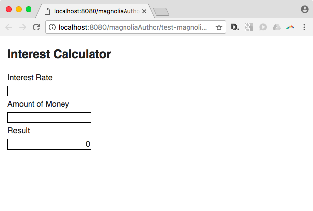
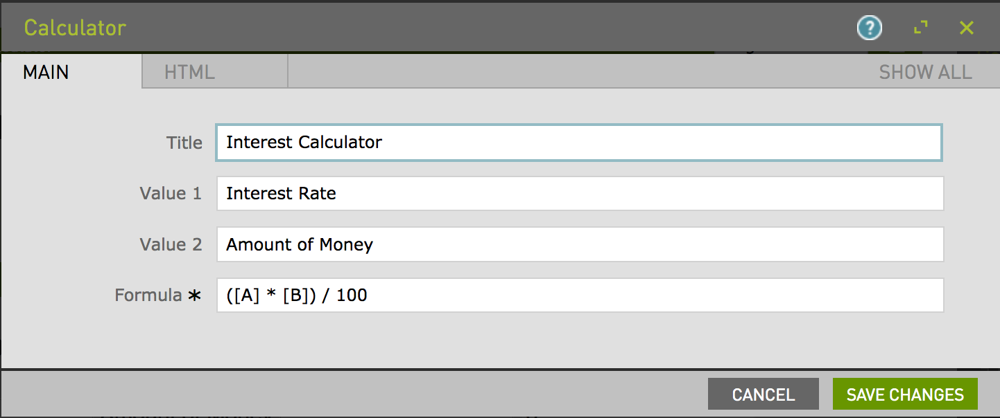

[](https://travis-ci.org/magnolia-cms/calculator-magnolia)

# calculator-magnolia

Simple configurable calculator, ie for interest or mortgage calculation - Component template for Magnolia CMS.

> (Demonstrates how to test light modules)

> (Demonstrates how to build resources with webpack)


## Features

Provide a simple calculator on a webpage to enable visitors to calculate a value based on a formula that you configure. Can be used to supply interest calculators, mortgage calculators, and the like. Calculator contains two fields.

Content author can supply formula as well as labels for the two fields.

Can be placed multiple times on one page.





## Usage

Make the component available to authors, and include the files in `webresources` on your pages using standard magnolia techniques.

(To make this component available on the mtk basic page, you could use the decoration included in `_dev/decorations`.)

### Depends on jQuery 3.x

jQuery 3.x must be available on the page.

To include the ecessary resources you could add the following fragment to your page template.
```
<script src="https://ajax.googleapis.com/ajax/libs/jquery/3.1.1/jquery.min.js"></script>
<script src=".resources/calculator-magnolia/webresources/js/bundle.js"></script>

```


## Tests

> This project illustrates how to test a shared Magnolia light module.

### Magnolia Template / Integration tests

The correct rendering of your template, including how it renders based on content entered with the dialog can be tested with a template test. This package demonstrates the following approach:
* Create demo page with component configured in various ways via the dialog.
* Export the page to an xml bootstrap file to `_dev/demos` directory.
* Tests are super simple and based `cheerio`. Mocha is used as test runner.
* Supply a travis-ci configuration so that your project will be automatically tested whenever it is pushed to github.


### JS Unit Tests

Unit tests are using Jest as test runner, as it supplies a DOM environment


### Travis

Main test step in Travis executes `npm test`

Setting up the Magnolia server is done with the `before_script` hook.


## Information on Magnolia CMS
This directory is a Magnolia 'light module'.

https://docs.magnolia-cms.com

Search the docs for `sharing light modules` for details on how to share and use light modules on npm and github.


## Contribute to the Magnolia component ecosystem
It's easy to create components for Magnolia and share them on github and npm. I invite you to do so and join the community. Let's stop wasting time by developing the same thing again and again, rather let's help each other out by sharing our work and create a rich library of components.

Just add `magnolia-light-module` as a keyword to npm's package.json to make them easy to find and use on npm.


## License

MIT
